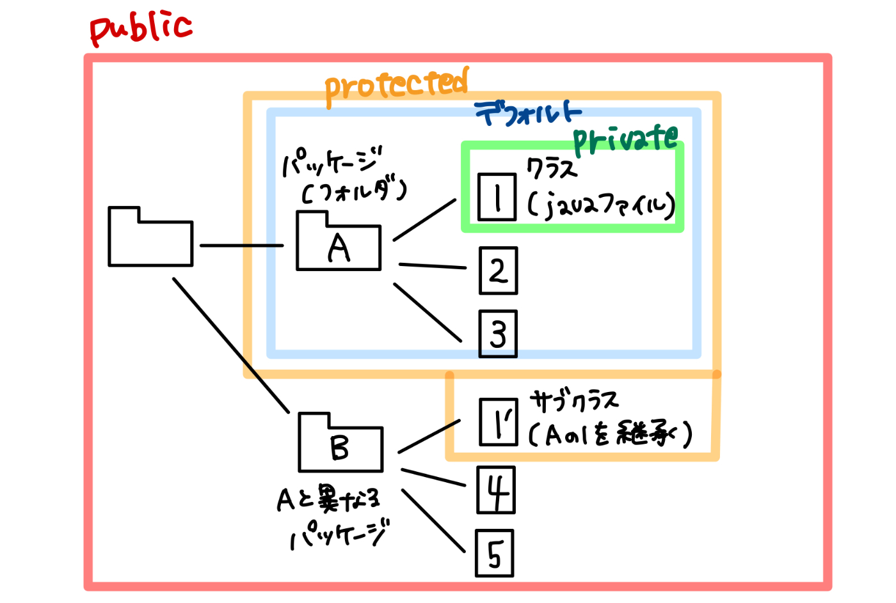

## Java クラス・継承・オーバーライド

## メソッドのオーバーライド
・子クラスで親クラスのメソッドを上書きすること。
・オーバーライドで上書きできるのは引数名と処理だけ。
・メソッドの名前、戻り値の型、引数の数、引数の型などは親クラスのメソッドと同じにする必要がある。

例）継承元＝親 から 継承先＝子　に継承したメソッドを　継承先でオーバーライドする場合

親：出力メソッド
```
public void output(int paramAge, double paramWeight){
    System.out.println(paramAge);
    System.out.println(paramWeight);
}

子：出力メソッド（オーバーライド）
```
public class Keisyo_Kato2 extends Keisyo_Human2 {
   public void output(int katoAge, double katoWeight){
      System.out.println("加藤の年齢は" + katoAge);
      System.out.println("加藤の体重は" + katoWeight);
   }
}

※メソッド名、戻り値の型、引数の数、引数の型は変更なし

## super
・superは、親クラスのコンストラクタを呼び出すことができる。
・親クラスのフィールドやメソッドにアクセスすることもできる。

（呼び出し方）
①子クラスのコンストラクタから親クラスのコンストラクタを呼び出す
    [super(引数)]

②親クラスのフィールド/メソッドにアクセスする際は、それぞれ
    [super.親クラスのフィールド], [super.親クラスのメソッド]
    の書式で呼び出す。

例）Keisyo_Human3 > Keisyo_Kato3 に継承して、superを使う
```
package text.section_17;
public class Keisyo_Human3 {
	// Keisyo_Human3 メソッドの定義
	Keisyo_Human3 ( String parameter ) {
		System.out.println(parameter);
	}
	
	// 体重フィールド（これをKeisyo_Kato3 で [super.weight] で呼び出す）
	double weight = 80.0;
}

package text.section_17;
public class Keisyo_Kato3 extends Keisyo_Human3 {
	// Keisyo_Kato3メソッドを定義
	Keisyo_Kato3(){
		// super(引数); で [親クラスのコンストラクタ] を呼び出す
		/* Keisyo_Human3(String parameter){	// super("Kato"); で引数 = String "Kato"を渡す
		   System.out.println(parameter);	// parameter = "Kato" が出力されるメソッドになる
		   } */
		super("Kato");
        // 親クラスのコンストラクタを呼び出して引数 Kato を渡して実行: Kato が出力される
		
        // 親クラスの [weightフィールド] にアクセス
		System.out.println(super.weight);
		/* 	親クラスの double weight = 80.0; にアクセスして 80.0 という値を取り出して出力 */
	}	
}

package text.section_17;
public class Keisyo_Main3 {
	public static void main(String[] args) {
		// Keisyo_Kato3クラスのオブジェクトを作る
		Keisyo_Kato3 kato = new Keisyo_Kato3();
		// 体重を設定する（super.weight=80.0 を 70.0で上書きする）
		kato.weight = 70.0;
	}
}
```

## アクセス修飾子
・変数やメソッドやクラスが、どこからアクセスできるかを表す
・アクセス修飾子は、public, protected, デフォルト(指定なし), privateの4種類
・変数やメソッドには4種類のうちどれでも1つ付けることができるが、クラスにはprotectedやprivateは付けられない(publicかデフォルトのみ)
・アクセス修飾子をつけてアクセスできる範囲を、スコープという

スコープが広い順
1. public
[どこからでも]アクセス可能(≒制限なし)
2. protected
[同一パッケージ]と[サブクラス]からアクセス可能
    ※サブクラス(子クラス)とは
    ・クラスの内容を継承して作られた新しいクラスのこと。
    ・継承元のクラスは、スーパークラス(親クラス)という。

3. デフォルト(指定なし)
[同一パッケージ内]のすべてのクラスからアクセス可能
    他パッケージ内のサブクラスからはアクセスできない
4. private
[同一クラス]からのみアクセス可能

アクセス修飾子	同一クラス	同一パッケージ	サブクラス
public         	  ○       	 ○         	 ○       ※すべてOK (= 他のパッケージも含む)
protected	 	  ○       	 ○         	 ○ 
デフォルト		  　○       　　○         	×
private           ○       　　×        	  ×
※サブクラス：別の親PKG内にある継承された子クラスのこと(この子クラスの親はsuperクラスと呼ばれる)


## パッケージ と クラス
・パッケージ：クラスをグループ化して分ける仕組み。
・クラス　　：プログラムを実行するための処理(メソッド)をまとめたもの。

## パッケージのインポート
参考：https://www.itsenka.com/contents/development/java/package.html
・パッケージをインポート(import)することで、パッケージ名を指定せずにクラスやインタフェースを呼び出せる。
・パッケージ内のクラスやインタフェースをインポートするには、次の書式でソースファイルの先頭（パッケージ「package」指定がある場合はその次）に指定する。
```
    import パッケージ名.クラス名;
    import パッケージ名.インタフェース名;
```
パッケージ内のクラスやインタフェースをインポートするには、次の書式でソースファイルの先頭（パッケージ「package」指定がある場合はその次）に指定します。

⚠️パッケージの指定「pakage」は複数指定することは出来ない。
    ただし、インポート「import」は複数記述することはできる。

また次のようにファイル名の記述部分を「*」（アスタリスク）を指定する事で、パッケージ内の全てのファイルをインポートする事も可能。
```
    import パッケージ名.*;
```

参照：https://zenn.dev/miya_akari/articles/7012029ec5455d
    akariさん


## 抽象クラス/抽象メソッド
・abstract をつける
　（クラス）　abstract public class ClassName {}
　（メソッド）abstract void method();　※↑のクラス内に記述。具体的な処理は記述していない。
・継承された子クラスで処理を実装（mainメソッドなど）
```
public class Keisyo_Kato6 extends Keisyo_Human6 {
	public static void main(String[] args) {
        ClassName mth = new ClassName();
        mth.method();
    }
    // 抽象メソッドに具体的な処理を実装する
    void method(){ 具体的な処理内容 };
}
```
