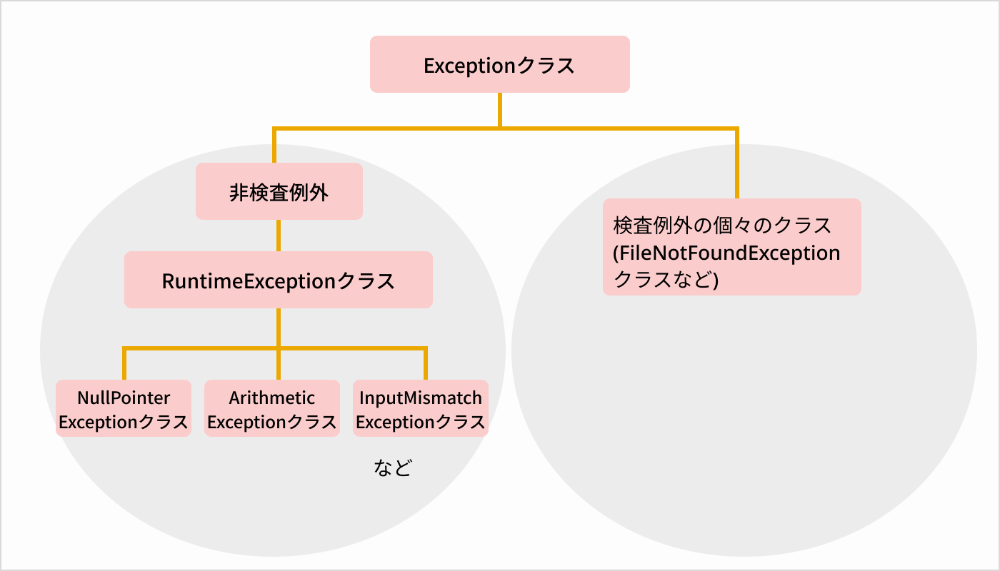

## 例外処理 と エラーハンドリング

例外処理             処理の詳細
  try-catch           try文で例外が起きているか確認し、例外が起きた場合catch文で処理する
  finally             例外の有無に関わらず実行される
  try-with-resource	  例外の有無に関わらずリソースを自動的にクローズする
  throw               意図的に例外を発生させる
  throws              メソッドの呼び出し元に例外を投げる

# Exceptionクラス (例外クラスの最後につけて書く！)
  例外を処理するクラスの継承元となるクラス。Exceptionクラスの継承先は、非検査例外であるRuntimeExceptionクラスと、検査例外であるクラス。
  非検査例外を行う個々のクラスは、さらにRuntimeExceptionクラスを継承
  

# プログラム実行時に発生するエラー
# 3種類の[障害]がある。

障害の種類	障害の特徴
  エラー	    javaの動作環境の問題など、プログラムでは対処できない致命的な状況を表す
  検査例外	  例外処理が実装されたことをコンパイラがチェックする例外なので、実装する必要がある
  非検査例外	例外処理が実装されたことをコンパイラがチェックしない例外なので、実装するかは任意

# [例外]は、次のような場合に該当の例外クラスが発生させる。
下表から、①どのような場合に、②どの例外クラスが例外を発生させるのか？を確認する。

例外が起きる場合	                  例外クラス	                          障害のタイプ
  配列のインデックスが範囲外の場合	    java.lang.IndexOutOfBoundsException	  非検査例外
  入力された値の型がプログラムが
    予想していた型と異なる場合         java.util.InputMismatchException	     非検査例外
  メソッドの呼び出しが不適切な場合    	java.lang.IllegalStateException	      非検査例外
  nullのオブジェクトにアクセスした場合	java.lang.NullPointerException	      非検査例外
  不適切な計算が行われた場合	         java.lang.ArithmeticException	       非検査例外
  メソッドの引数に
  不正な引数が渡された場合             java.lang.IllegalArgumentException    非検査例外
  ファイルが見つからない場合           java.io.FileNotFoundException	       ⭐️検査例外

## 例外処理の実装
# try-catch-finally文
  [try文]  ：例外が起きているか確認
  [catch文]：例外が起きた場合の処理内容
  [finally文]：例外の有無に関わらず実行される処理　→ scannerクラスの[close:入力終了]など
```
try{
  例外が起きているか確認する処理
} catch(例外クラス 変数名){
  例外が起きた場合に行う処理
}
```

# サンプルコード
```
		// 配列の宣言
		int[] number = new int[1];  // 1個のint型の配列を生成
		
		// try文（例外有無を確認）
		try {
			number[0] = 1;	// ①非例外：非該当 → "処理終了です" と表示（catch文を抜ける）
			number[1] = 2;	// ②例外：該当 → "配列のインデックスが範囲外です" と表示（catch文で処理)
		// catch文（例外クラス 変数名）
		} catch (ArrayIndexOutOfBoundsException e) {	// eは変数, 例外クラスはエラーの内容
			// ②例外時の処理内容（配列のインデックスが範囲外の場合）に行う処理
			System.out.println("配列のインデックスが範囲外です");			
		}  finally {
		// ①非例外の場合の処理内容
		System.out.println("処理終了です");
		}
```

# 複数の例外処理 （try-catch*）
```
catch(例外クラス 変数名){
   例外が起きた場合に行う処理
}
catch(例外クラス 変数名){
   例外が起きた場合に行う処理
}
catch(例外クラス 変数名){
   例外が起きた場合に行う処理
}
```

# サンプルコード
```
package text.section_024;
public class Exception_Test3 {
	public static void main(String[] args) {
		
		// フィールド
		int number1 = 2;
		int number2 = 0;
		
		// try-catch*catch文
		try {
			// 割り算の結果を取得する
			System.out.println(number1 / number2);
		} catch (IllegalStateException e) {
			// メソッドの呼び出しが不適切な場合に行う処理
			System.out.println("メソッドの呼び出しが不適切です");
		} catch (NullPointerException e) {
			// オブジェクトがnullの場合に行う処理
			System.out.println("オブジェクトがnullです");
		} catch (ArithmeticException e) {
			// 不適切な計算が行なわれた場合に行う処理
			System.out.println("不適切な計算が行なわれました");
		}
	
		System.out.println("処理終了です");
	}
}
```
# try-with-resource文 （リソースを自動的にクローズする！）
　例外の有無に関わらず,リソースを自動的にクローズする（リソースのクローズ忘れを防ぎたい）場合などに使う。
```
try(リソースとなるオブジェクトの生成 [例：Scanner scanner = new scanner(System.in)]){
   リソースとなるオブジェクトによる処理 [例：input = scanner.next();]
};　 // ;つける！
```
# サンプルコード
```
package text.section_024;
import java.util.Scanner;
public class Exception_Test4 {
	public static void main(String[] args) {
		System.out.println("入力しましょう");
		
		// 初期値(null=未入力の場合を想定)		
		String input = null;
		
		// Scannerクラスのオブジェクトを生成する
		try (Scanner scanner = new Scanner(System.in)) {
			// 入力した内容を取得する
			input = scanner.next();
		};	
		
		// 自動で処理が自動的にクローズ
		
		// 入力した内容を出力する
		System.out.println("入力した内容は" + input);
	}
}
```
⭐️Point:try-catch-finallyとの違い
　finally{}に処理を「書けば」必ず処理は実行されるが、「書き忘れたら」処理は実行されない。
　→try-with-resource文なら、記述忘れの場合も心配いらない。　

# throw （意図的に例外を発生させる！）
  例外は、例外が発生したと判定される場合以外にも意図的に発生させることができる。
  任意の場所で例外処理をしたい場合などに使う。

```
throw new 意図的に発生させる例外クラス
```

# サンプルコード
```
package text.section_024;
public class Exception_Test5 {
	public static void main(String[] args) {
		// 体重を表す変数
		double weight = -10.0;
		// 体重がマイナス値の場合に、「意図的に」例外を発生させる
		if (weight < 0) {
			throw new IllegalArgumentException ("体重は入力された" + weight + "のようにマイナスの値になりません");
		}
	}
}
```
コンソール　（意図的に例外(エラー)を表示）
```
Exception in thread "main" java.lang.IllegalArgumentException: 
体重は入力された-10.0のようにマイナスの値になりません
```

# throws(呼び出し元に例外を投げるメソッド)
  メソッドで例外が発生した場合に、メソッドの呼び出し元に例外を投げることができる。
  メソッドの呼び出し元に例外処理を任せる場合に使う。

```
メソッド名() throws Exceptionクラス名 {
}
```
# サンプルコード
```
package text.section_024;
import java.io.File;
import java.io.FileNotFoundException;
import java.util.Scanner;
public class Exception_Test5 {

// file内容を取得するメソッド method1()に[throws]を設定
	static void method1() throws FileNotFoundException {
		// Scannerクラスのオブジェクトを生成する
		Scanner scanner = new Scanner(new File("method1.txt")); 
		
		// ファイルの読み込みが続く場合、処理を続ける
		while (scanner.hasNext()) {
			// 改行までの入力を受け取る
			String input = scanner.nextLine();
			System.out.println(input);
		}
	}
	
  // mainメソッド
	public static void main(String[] args) {
		try {
			method1();
		} catch (FileNotFoundException e) {
			// ファイルがみつからない場合に行う処理
			System.out.println("ファイルが見つかりません");
		}
	}
}
```

